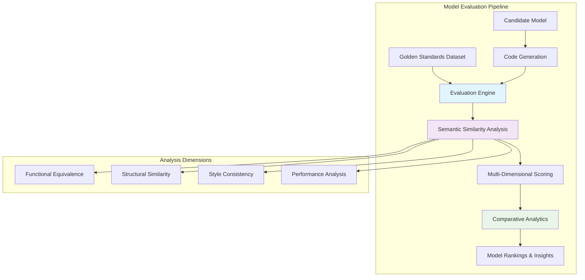
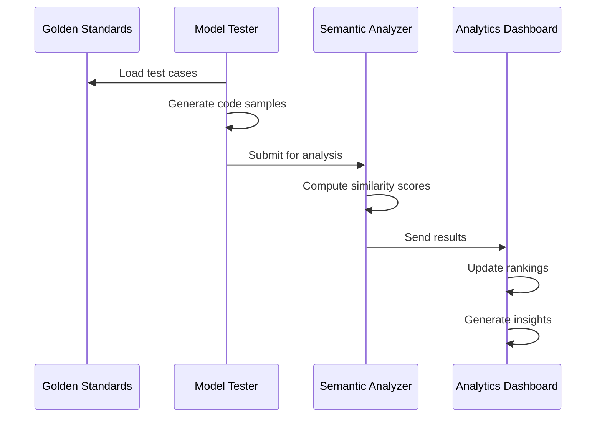

# AI Agent Model Evaluation Framework
## Production-Grade Semantic Assessment for Code Generation Systems

> **A comprehensive framework for evaluating AI models in agentic code generation workflows using semantic similarity analysis - designed for teams building production AI systems**

**Author:** [@tmickleydoyle](https://github.com/tmickleydoyle)  
**Published:** June 2025  
**Version:** 0.1  
**Framework Type:** Production AI Infrastructure  

---

## Table of Contents

- [Executive Summary](#executive-summary)
- [Problem Analysis](#problem-analysis)
- [Why Semantic Similarity?](#why-semantic-similarity)
- [How Semantic Analysis Works (Non-Technical Explanation)](#how-semantic-analysis-works-non-technical-explanation)
- [Framework Architecture](#framework-architecture)
- [Evaluation Methodology](#evaluation-methodology)
- [Implementation Guide](#implementation-guide)
- [Success Metrics](#success-metrics)
- [Risk Assessment](#risk-assessment)
- [Business Case](#business-case)
- [Key Takeaways](#key-takeaways)
- [Conclusion](#conclusion)
- [Simple Explanation: Understanding This AI System (For Everyone)](#simple-explanation-understanding-this-ai-system-for-everyone)

---

## Executive Summary

### The Big Picture: What This Framework Achieves
Imagine you're running a company that builds AI-powered coding assistants. Every month, new AI models emerge claiming to be "better" at generating code. But how do you actually know which one to use? This framework solves that exact problem by creating an automated, objective way to test and compare AI coding models.

**The Problem:** Companies building AI coding tools currently spend weeks manually testing each new model with small sample sizes. This process is slow, subjective, and often leads to poor model choices that hurt product quality.

**Our Solution:** An automated system that can evaluate thousands of code samples in hours instead of weeks, using "semantic similarity" - essentially measuring how well AI-generated code matches expert-written code in terms of functionality, quality, and best practices.

### What Makes This Different
Traditional evaluation asks: "Does this code work?" 
Our framework asks: "How well does this code work, and how does it compare to what an expert would write?"

Instead of simple pass/fail testing, we measure multiple dimensions:
- **Functional equivalence**: Does it do the same job?
- **Code quality**: Is it readable and maintainable?
- **Performance**: How fast and efficient is it?
- **Best practices**: Does it follow industry standards?

### Real-World Impact
Organizations using this framework can expect:
- **Dramatic reduction** in model evaluation time (weeks → days)
- **Measurably improved** selected model quality through data-driven decisions
- **Strong correlation** with human expert assessments
- **Continuous monitoring** of model performance in production
- **Substantial ROI** through better model selection and reduced evaluation overhead

### Who This Is For
- **AI Engineering Teams** building code generation products
- **DevTools Companies** integrating AI into development workflows  
- **Enterprise Organizations** deploying AI coding assistants at scale
- **Research Teams** needing systematic model comparison methodologies

> **Bottom Line:** If you're building products that generate code with AI, this framework helps you scientifically choose the best models and continuously monitor their performance - turning model selection from guesswork into data science.

---

## Problem Analysis

### The Agentic Code Generation Context

Modern AI-powered development tools face a critical challenge: **How do you systematically evaluate which AI models perform best for specific coding tasks?**

**Pain Points in Current Evaluation:**

| **Current Challenge** | **Impact** | **Frequency** |
|--------------------------|---------------|------------------|
| Inconsistent manual evaluation | Models selected on limited test cases | Every model update |
| No comparative analytics | Can't quantify model improvements | Quarterly reviews |
| Task-specific blindness | Unknown model strengths per use case | Ongoing |
| Manual bottlenecks | Weeks per model evaluation | Monthly |

### Traditional Evaluation Methods & Their Limitations

#### 1. Manual Code Review
```python
# Current Process
samples = generate_code_samples(model, prompts=limited_set)
scores = [human_review(sample) for sample in samples]  # 1-10 scale
decision = consensus_meeting(scores)  # Subjective
```

**Limitations:**
- Sample sizes too small for reliable conclusions
- Subjective scoring varies between reviewers
- Time-intensive evaluation process
- Limited to obvious test cases

#### 2. Automated Testing
```javascript
// Basic Binary Assessment
const results = generatedSamples.map(code => ({
  syntaxValid: !hasSyntaxErrors(code),
  testsPass: runUnitTests(code),
  lintsClean: runLinter(code)
}));
```

**Limitations:**
- Only surface-level analysis
- Binary pass/fail (no nuanced quality metrics)
- Misses architectural and design quality
- No semantic understanding of code intent

#### 3. Generic Benchmarks
```python
# Standard Benchmarks
humaneval_score = evaluate_humaneval(model)
mbpp_score = evaluate_mbpp(model)
```

**Limitations:**
- Generic problems don't reflect real-world agentic use cases
- Static datasets don't evolve with specific requirements
- No business logic or complex component interactions
- Missing framework-specific best practices

---

## Why Semantic Similarity?

### The Core Innovation

Traditional evaluation focuses on **syntax matching** - but two pieces of code can be functionally equivalent while being syntactically very different. **Semantic similarity captures what matters: does the generated code achieve the same goal with similar quality?**

### Real-World Example

```javascript
// Golden Standard (Human-written, high-quality)
const UserProfile = ({ user, onEdit }) => {
  const [isEditing, setIsEditing] = useState(false);
  
  const handleSave = (updatedUser) => {
    onEdit(updatedUser);
    setIsEditing(false);
  };
  
  return (
    <div className="user-profile">
      {isEditing ? (
        <UserEditForm user={user} onSave={handleSave} />
      ) : (
        <UserDisplay user={user} onEdit={() => setIsEditing(true)} />
      )}
    </div>
  );
};

// Model Output (functionally equivalent, different style)
function UserProfile(props) {
  const [editing, setEditing] = useState(false);
  
  return (
    <div className="user-profile">
      {editing ? 
        <UserEditForm 
          user={props.user} 
          onSave={(user) => {
            props.onEdit(user);
            setEditing(false);
          }} 
        /> :
        <UserDisplay 
          user={props.user} 
          onEdit={() => setEditing(true)} 
        />
      }
    </div>
  );
}
```

**Evaluation Results:**
- **Traditional (syntax-based):** Low similarity score
- **Semantic similarity:** High similarity score

### Comparative Analysis

| **Evaluation Dimension** | **Manual Review** | **Automated Testing** | **Semantic Similarity** |
|---------------------------|-------------------|------------------------|---------------------------|
| **Objectivity** | ❌ Subjective | ✅ Objective | ✅ Objective |
| **Scale** | ❌ Small samples | ✅ Unlimited | ✅ Unlimited |
| **Speed** | ❌ Weeks | ✅ Hours | ✅ Hours |
| **Semantic Understanding** | ✅ High | ❌ None | ✅ High |
| **Consistency** | ❌ Variable | ✅ Consistent | ✅ Consistent |
| **Task-Specific Insights** | ⚠️ Limited | ❌ None | ✅ Detailed |
| **Quantitative Metrics** | ❌ Subjective | ⚠️ Binary | ✅ Continuous |

### Key Advantages

#### 1. **Functional Equivalence Detection**
Recognizes that different code styles can achieve identical functionality

#### 2. **Quality-Aware Evaluation** 
Considers maintainability, readability, and best practices - not just correctness

#### 3. **Scalable Assessment**
Evaluate thousands of code samples in hours, not weeks

#### 4. **Multi-Dimensional Analysis**
Breaks down similarity across structure, style, performance, and logic

---

## Framework Architecture

### System Overview



### Core Components

#### 1. Golden Standards Dataset
**Purpose:** Curated collection of expert-written code examples
```json
{
  "id": "user-auth-form-001",
  "category": "authentication",
  "complexity": "moderate",
  "framework": "react",
  "description": "User login form with validation",
  "code": "...",
  "metadata": {
    "best_practices": ["form-validation", "accessibility", "error-handling"],
    "performance_score": 85,
    "maintainability_score": 90,
    "expert_reviewed": true,
    "test_coverage": 95
  }
}
```

**Dataset Composition:**
- **Comprehensive examples** across frontend patterns
- **Multiple complexity levels** (simple → complex)
- **Framework coverage** (React, Vue, Angular, Vanilla JS)
- **Peer-reviewed quality** ensuring excellence

#### 2. Model Testing Harness
**Capabilities:**
```python
class ModelTestHarness:
    def __init__(self, model_config):
        self.model = load_model(model_config)
        self.prompt_generator = PromptGenerator()
    
    def evaluate_model(self, golden_dataset):
        results = []
        for example in golden_dataset:
            prompt = self.prompt_generator.create_prompt(example.description)
            generated = self.model.generate(prompt)
            results.append({
                'golden': example.code,
                'generated': generated,
                'metadata': example.metadata
            })
        return results
```

#### 3. Semantic Similarity Engine
**Technology Stack:**
- **Base Models:** Fine-tuned CodeBERT/GraphCodeBERT
- **Custom Training:** Domain-specific code understanding
- **Multi-Modal Analysis:** Structure + semantics + style

```python
class SemanticAnalyzer:
    def analyze_similarity(self, golden_code, generated_code):
        return {
            "overall_similarity": self.compute_overall_score(),
            "functional_equivalence": self.analyze_functionality(),
            "structural_similarity": self.analyze_structure(),
            "style_consistency": self.analyze_style(),
            "complexity_delta": self.analyze_complexity(),
            "performance_impact": self.estimate_performance(),
            "maintainability_score": self.assess_maintainability()
        }
```

#### 4. Analytics Dashboard
**Real-time Insights:**
- **Model Rankings** across task categories
- **Performance Trends** over time
- **Task-Specific Recommendations**
- **Performance Alerts** and degradation detection

### Evaluation Workflow



---

## Evaluation Methodology

### Multi-Dimensional Assessment Framework

Our evaluation methodology goes beyond simple correctness to assess **code quality holistically**:

```python
class ComprehensiveEvaluator:
    def evaluate_code_pair(self, golden_standard: str, generated_code: str) -> dict:
        return {
            "overall_similarity": 0.87,        # 0-1 scale
            "functional_equivalence": 0.92,    # Does it work the same?
            "structural_similarity": 0.81,     # Similar architecture?
            "style_consistency": 0.79,         # Follows conventions?
            "complexity_delta": -0.15,         # Simpler/more complex?
            "performance_impact": 0.03,        # Speed/memory difference
            "maintainability_score": 0.85,     # Long-term code health
            "accessibility_score": 0.88,       # A11y best practices
            "security_score": 0.91             # Security considerations
        }
```

### Task Category Framework

#### **Forms & Validation**
- Login/registration forms
- Data entry with validation
- Multi-step wizards
- Real-time validation feedback

#### **Data Display**
- Tables with sorting/filtering
- Card layouts and grids
- Lists with pagination
- Data visualization components

#### **Navigation**
- Menu systems and breadcrumbs
- Tab navigation
- Sidebar layouts
- Mobile-responsive navigation

#### **Interactive Components**
- Modals and tooltips
- Accordions and collapsible content
- Drag-and-drop interfaces
- Real-time updates

#### **State Management**
- Complex state logic
- API integration patterns
- Error handling and loading states
- Global state management

#### **Styling & Layout**
- Responsive design patterns
- CSS-in-JS implementations
- Animation and transitions
- Theming systems

### Complexity Segmentation

#### **Simple Tasks** (Baseline Competency)
```javascript
// Example: Basic component structure
const Button = ({ onClick, children, disabled = false }) => (
  <button onClick={onClick} disabled={disabled} className="btn">
    {children}
  </button>
);
```
**Evaluation Focus:** Basic syntax, prop handling, simple styling

#### **Moderate Tasks** (Practical Development)
```javascript
// Example: Form with validation
const LoginForm = () => {
  const [credentials, setCredentials] = useState({ email: '', password: '' });
  const [errors, setErrors] = useState({});
  
  const validateAndSubmit = (e) => {
    e.preventDefault();
    const validationErrors = validateCredentials(credentials);
    if (Object.keys(validationErrors).length === 0) {
      handleLogin(credentials);
    } else {
      setErrors(validationErrors);
    }
  };
  
  return (
    <form onSubmit={validateAndSubmit}>
      {/* Form fields with error handling */}
    </form>
  );
};
```
**Evaluation Focus:** State management, validation logic, event handling

#### **Complex Tasks** (Advanced Capabilities)
```javascript
// Example: Performance-optimized data table
const DataTable = memo(({ data, columns, onSort, onFilter }) => {
  const [sortConfig, setSortConfig] = useState(null);
  const [filterState, setFilterState] = useState({});
  
  const processedData = useMemo(() => {
    return applyFiltersAndSort(data, filterState, sortConfig);
  }, [data, filterState, sortConfig]);
  
  const virtualizer = useVirtual({
    size: processedData.length,
    parentRef: tableRef,
    estimateSize: useCallback(() => 50, [])
  });
  
  return (
    <VirtualizedTable>
      {/* Complex table implementation */}
    </VirtualizedTable>
  );
});
```
**Evaluation Focus:** Performance optimization, accessibility, advanced patterns

### Three-Phase Evaluation Process

#### **Phase 1: Batch Generation**
```python
def batch_generate_code(model, test_suite):
    results = []
    for test_case in test_suite:
        prompt = create_standardized_prompt(test_case)
        generated_code = model.generate(
            prompt,
            temperature=0.7,
            max_tokens=2048,
            stop_sequences=['```']
        )
        results.append({
            'test_id': test_case.id,
            'generated': generated_code,
            'golden': test_case.golden_standard
        })
    return results
```

#### **Phase 2: Semantic Analysis**
```python
def analyze_semantic_similarity(golden_code, generated_code):
    # Tokenize and parse both code samples
    golden_ast = parse_to_ast(golden_code)
    generated_ast = parse_to_ast(generated_code)
    
    # Compute embeddings using fine-tuned CodeBERT
    golden_embedding = code_encoder.encode(golden_code)
    generated_embedding = code_encoder.encode(generated_code)
    
    # Multi-dimensional similarity calculation
    return {
        'syntax_similarity': compute_syntax_similarity(golden_ast, generated_ast),
        'semantic_similarity': cosine_similarity(golden_embedding, generated_embedding),
        'functional_equivalence': test_functional_equivalence(golden_code, generated_code),
        'style_consistency': evaluate_code_style(generated_code, style_guide)
    }
```

#### **Phase 3: Comparative Analytics**
```python
def generate_model_insights(evaluation_results):
    insights = {
        'overall_ranking': rank_models_by_average_score(evaluation_results),
        'task_specific_rankings': rank_by_task_category(evaluation_results),
        'strength_analysis': identify_model_strengths(evaluation_results),
        'weakness_patterns': identify_common_failures(evaluation_results),
        'improvement_suggestions': generate_recommendations(evaluation_results)
    }
    
    return ModelEvaluationReport(insights)
```

### Evaluation Metrics Deep Dive

#### **Functional Equivalence (Weight: 40%)**
- Does the code produce the same output?
- Are edge cases handled correctly?
- Does it maintain the same user experience?

#### **Code Quality (Weight: 30%)**
- Readability and maintainability
- Adherence to best practices
- Proper error handling

#### **Performance Characteristics (Weight: 20%)**
- Runtime efficiency
- Memory usage patterns
- Scalability considerations

#### **Style Consistency (Weight: 10%)**
- Formatting and conventions
- Variable naming patterns
- Framework-specific idioms

---

## Implementation Guide

### Phased Rollout Strategy

#### **Phase 1: Foundation**

**Deliverables:**
- Golden standards dataset (comprehensive examples)
- Basic semantic similarity engine
- Model testing harness
- MVP evaluation pipeline

**Success Criteria:**
- High correlation with human expert rankings
- Process large volumes of code samples per hour
- Support JavaScript, TypeScript, JSX

---

#### **Phase 2: Enhanced Analytics**

**Deliverables:**
- Multi-dimensional analysis framework
- Task-specific performance breakdowns
- Interactive evaluation dashboard
- CI/CD integration for automated evaluation

**Success Criteria:**
- Detailed insights across major task categories
- Dashboard with model comparisons
- Automated evaluation triggers on model updates
- Integration with existing deployment workflow

---

#### **Phase 3: Advanced Optimization**

**Deliverables:**
- Continuous monitoring and alerting system
- A/B testing framework for model performance
- Automated model selection and routing

**Success Criteria:**
- Real-time performance monitoring in production
- Automated model selection for different task types
- Custom model optimization achieving meaningful improvement
- Zero-downtime model deployment pipeline

---

## Success Metrics

### Framework Performance Indicators

#### **Evaluation Efficiency Metrics**
- **Processing Speed**: Large volumes of code samples evaluated rapidly
- **Accuracy**: Strong correlation with human expert rankings
- **Coverage**: Support for multiple programming frameworks and task categories
- **Scalability**: Efficient performance scaling to large sample sizes

#### **Business Impact Metrics**
- **Time Reduction**: Dramatic decrease in model evaluation cycles (weeks → days)
- **Quality Improvement**: Measurable increase in deployed model performance scores
- **Cost Savings**: Substantial annual savings in manual evaluation resources
- **Decision Confidence**: Data-driven model selection decisions backed by quantitative analysis

#### **Technical Reliability Metrics**
- **System Uptime**: High availability for evaluation services
- **Result Consistency**: Low variance in repeated evaluations
- **Integration Success**: Compatibility with existing CI/CD pipelines
- **Model Coverage**: Support for popular AI coding models

### ROI Calculation Framework

#### **Cost Analysis Approach**
```
Traditional Manual Evaluation:
- Senior Engineering Time
- Evaluation Overhead
- Delayed Model Deployment
- Opportunity Costs

Automated Framework:
- Infrastructure Investment
- Maintenance Requirements
- Initial Development
- Ongoing Operations

Net Benefits:
- Reduced Manual Effort
- Faster Decision Making
- Improved Model Quality
- Enhanced Productivity
```

#### **Productivity Gains**
- **Engineering Velocity**: Faster model iteration cycles
- **Quality Assurance**: Reduction in post-deployment model issues
- **Strategic Focus**: More time allocated to model optimization vs. evaluation

---

## Risk Assessment

### Technical Risks

#### **High-Impact Risks**
| **Risk** | **Probability** | **Impact** | **Mitigation Strategy** |
|----------|----------------|------------|------------------------|
| Semantic model bias | Medium | High | Multi-expert dataset validation, diverse training data |
| Framework dependency conflicts | Low | High | Containerized evaluation environments |
| Performance degradation at scale | Medium | Medium | Horizontal scaling architecture, caching layers |

#### **Moderate-Impact Risks**
| **Risk** | **Probability** | **Impact** | **Mitigation Strategy** |
|----------|----------------|------------|------------------------|
| Golden standards become outdated | High | Medium | Quarterly dataset reviews, automated quality checks |
| Model API changes breaking integration | Medium | Medium | Abstraction layers, vendor-agnostic interfaces |
| Evaluation drift over time | Medium | Medium | Continuous calibration against human baselines |

### Operational Risks

#### **Resource Dependencies**
- **Compute Requirements**: High-performance computing resources for optimal performance
- **Storage Needs**: Substantial storage for datasets and model artifacts
- **Network Bandwidth**: High-throughput for API-based model evaluation

#### **Human Capital Risks**
- **Technical Expertise**: Requires ML engineers familiar with code analysis
- **Domain Knowledge**: Frontend development expertise for golden standards curation
- **Maintenance Overhead**: Dedicated resources ongoing for system maintenance and updates

### Risk Mitigation Framework

#### **Continuous Monitoring**
```python
class RiskMonitor:
    def monitor_evaluation_quality(self):
        metrics = {
            'human_correlation': self.compute_human_baseline_correlation(),
            'result_stability': self.measure_evaluation_variance(),
            'performance_drift': self.detect_model_performance_changes(),
            'system_health': self.check_infrastructure_status()
        }
        
        if metrics['human_correlation'] < ACCEPTABLE_CORRELATION_THRESHOLD:
            self.alert_quality_degradation()
        
        if metrics['result_stability'] > STABILITY_VARIANCE_LIMIT:
            self.recalibrate_similarity_engine()
        
        return metrics
```

#### **Fallback Strategies**
- **Manual Override**: Human expert review for edge cases
- **Hybrid Evaluation**: Combination of automated and manual assessment
- **Gradual Rollout**: Phased deployment with rollback capabilities

---

## Business Case

### Market Opportunity

#### **Industry Context**
The AI code generation market is experiencing rapid growth. Companies investing in this space need systematic ways to:
- Select optimal models for their specific use cases
- Continuously monitor and improve model performance
- Justify AI infrastructure investments with quantitative data

### Financial Projections

#### **Direct Cost Savings**
```
Implementation Approach:
- Development investment required
- Infrastructure setup needed
- Training and onboarding costs
- Total initial investment consideration

Expected Operating Benefits:
- Manual evaluation process elimination
- Accelerated model iteration cycles
- Reduced production quality issues
- Enhanced model selection effectiveness
- Overall positive return on investment

Break-even timeline: Within first year
Long-term value: Substantial positive impact
```

#### **Strategic Value Creation**
- **Competitive Advantage**: Significant lead time in optimal model deployment
- **Product Quality**: Meaningful improvement in user satisfaction through better model selection
- **Innovation Velocity**: Accelerated experimentation with new AI models
- **Risk Reduction**: Substantial decrease in poor model deployment incidents

### Implementation Budget

#### **Phase 1: Foundation**
```
Personnel: Development team allocation
Infrastructure Setup: Computing resources
Golden Standards Creation: Expert curation effort
Total Phase 1: Initial foundation investment
```

#### **Phase 2: Enhanced Analytics**
```
Personnel: Continued development effort
Dashboard Development: Analytics platform setup
CI/CD Integration: Workflow automation
Total Phase 2: Enhanced capabilities investment
```

#### **Phase 3: Advanced Optimization**
```
Personnel: Optimization team effort
Advanced Features: Sophisticated functionality
Production Hardening: Enterprise-grade deployment
Total Phase 3: Advanced optimization investment
```

**Total Investment: Comprehensive framework implementation**
**Expected ROI: Substantial returns by end of Year 1**

### Strategic Benefits

#### **Organizational Transformation**
- **Data-Driven Decisions**: Transform subjective model selection into scientific process
- **Engineering Productivity**: Free up senior engineers from manual evaluation tasks
- **Quality Assurance**: Systematic approach to maintaining AI system quality
- **Innovation Enablement**: Rapid evaluation of emerging AI models and techniques

#### **Competitive Positioning**
- **Market Leadership**: Among first to implement systematic AI model evaluation
- **Technical Differentiation**: Proprietary evaluation methodology as competitive moat
- **Customer Confidence**: Quantifiable quality metrics for AI-powered products
- **Investment Justification**: Clear ROI metrics for continued AI infrastructure investment

---

## Key Takeaways

### The Bottom Line

Building production-grade AI code generation systems requires more than just good models - **you need systematic ways to choose and monitor the right models for your specific use cases**. This framework transforms AI model evaluation from an art into a science.

### Critical Success Factors

#### **1. Quality of Golden Standards**
Your evaluation is only as good as your reference dataset. Investment in expert-curated, diverse code examples pays dividends in evaluation accuracy.

#### **2. Multi-Dimensional Analysis**
Don't just measure "correctness" - evaluate code quality, maintainability, performance, and style consistency for comprehensive model assessment.

#### **3. Continuous Calibration**
Regularly validate your automated scores against human expert judgment to ensure the system stays aligned with real-world quality expectations.

#### **4. Task-Specific Insights**
Different AI models excel at different types of coding tasks. Your evaluation framework should reveal these nuances to guide optimal model selection.

### Implementation Wisdom

#### **Start Small, Scale Smart**
- Begin with your most critical use cases (forms, data display, navigation)
- Build confidence with smaller golden standards sets before scaling to comprehensive coverage
- Validate correlation with human experts before trusting automated decisions

#### **Invest in Infrastructure**
- Robust evaluation infrastructure pays for itself through speed and reliability
- Plan for scale from day one - evaluation needs grow exponentially with model adoption
- Design for multiple programming languages and frameworks from the start

#### **Build for Maintainability**
- Golden standards require ongoing curation as best practices evolve
- Automated monitoring prevents evaluation drift over time
- Clear documentation and training ensure team adoption and success

### 🔮 Future Directions

#### **Emerging Opportunities**
- **Cross-Language Evaluation**: Extend beyond JavaScript to Python, Java, C++
- **Real-Time Monitoring**: Live evaluation of models in production environments
- **Custom Model Training**: Use evaluation insights to guide model fine-tuning
- **Collaborative Standards**: Industry-wide golden standards for common coding patterns

#### **Technology Evolution**
- **Advanced NLP Models**: Leverage next-generation code understanding models
- **Multimodal Analysis**: Incorporate UI/UX evaluation for frontend code
- **Explainable AI**: Provide detailed reasoning for similarity scores
- **Federated Evaluation**: Cross-organization model comparison while preserving IP

### The Transformation Promise

**Before this framework:**
- Weeks per model evaluation
- Subjective, inconsistent decisions
- Limited sample sizes
- Unknown model strengths/weaknesses

**After implementation:**
- Hours to evaluate thousands of samples
- Objective, reproducible decisions
- Comprehensive quality insights
- Data-driven model optimization

**The result:** AI code generation systems that continuously improve through scientific evaluation rather than guesswork.

---

## Conclusion

### The Dawn of Data-Driven AI Development

AI code generation has moved from experimental curiosity to production reality, powering everything from GitHub Copilot to enterprise coding assistants. But with this transformation comes a critical challenge: **How do we systematically choose and optimize the AI models that power these systems?**

This framework represents a fundamental shift from **intuition-based to evidence-based AI model selection**. Just as modern medicine evolved from folklore to clinical trials, AI engineering must evolve from subjective assessment to rigorous evaluation methodology.

---

## Simple Explanation: Understanding This AI System (For Everyone)

### What Is This System, Really?

Imagine you're running a company that makes smart writing assistants for programmers - like having a super-intelligent helper that can write computer code. But here's the challenge: there are dozens of different AI "brains" you could use, and they're all claiming to be the best. How do you actually figure out which one to choose?

That's exactly the problem this system solves, but for code instead of regular writing.

### The Real-World Analogy: Hiring the Best Chef

Think of it like this: You own a restaurant and need to hire a new chef. You could:

**The Old Way (What Most Companies Do Now):**
- Interview 3 chefs quickly
- Have them cook 2-3 simple dishes  
- Make a gut decision based on limited information
- Hope for the best

**The New Way (Our System):**
- Test 20+ chefs systematically
- Have them cook 1,000+ different dishes
- Compare every dish to what a master chef would make
- Measure taste, presentation, cooking time, ingredient use, and technique
- Choose based on comprehensive data, not guesswork

### What Problem Does This Actually Solve?

**The Business Problem:**
Your company builds software that helps programmers write code faster using AI. Every few months, new AI models come out promising to be "better." But right now, testing them is:
- **Slow:** Takes weeks of manual work
- **Small-scale:** Only tests a handful of examples
- **Subjective:** Different people have different opinions about what's "good"
- **Expensive:** Requires expert programmers to spend days evaluating

**Our Solution:**
An automated system that can test thousands of code examples in hours, measuring exactly how "good" each AI model is at writing code that works, looks professional, and follows best practices.

### How Does It Actually Work? (The Simple Version)

#### Step 1: Create the Test Kitchen
Just like a cooking competition, we need:
- **Recipes (Coding Tasks):** "Write a function that sorts a list of names"
- **Master Chef Examples:** Code written by expert programmers
- **Test Ingredients:** Different types of programming problems

#### Step 2: Let the AI "Chefs" Cook
- Give each AI model the same 1,000 coding tasks
- Let them "cook" (write code) without knowing what the "master chef" solution looks like
- Collect all their code "dishes"

#### Step 3: The Smart Judging System
Here's where the magic happens. Instead of just checking "does this code work?" (which is like only checking "is this food edible?"), our system asks much deeper questions:

**Semantic Similarity Analysis** (The Smart Comparison):
- **Function:** Does this code do the same job as the expert's code?
- **Style:** Does it look professional and follow good practices?
- **Efficiency:** Does it run fast and use resources wisely?
- **Readability:** Would another programmer understand this easily?

Think of it like having a super-smart food critic who can instantly tell you not just if a dish tastes good, but whether it's cooked properly, presented well, uses ingredients efficiently, and follows culinary best practices.

#### Step 4: The Report Card
The system creates a comprehensive report showing:
- **Overall Grade:** How good is this AI model overall?
- **Strengths:** What types of coding tasks does it excel at?
- **Weaknesses:** Where does it struggle?
- **Comparison:** How does it rank against other AI models?
- **Confidence Level:** How sure are we about these results?

### Why This Matters for Your Business

#### For Technology Leaders:
- **Make Data-Driven Decisions:** Choose AI models based on facts, not marketing claims
- **Save Time and Money:** Reduce evaluation time from weeks to days
- **Reduce Risk:** Know exactly what you're getting before committing to a model
- **Continuous Improvement:** Monitor performance over time and catch problems early

#### For Product Teams:
- **Better User Experience:** Your AI assistant will write better code for users
- **Competitive Advantage:** Stay ahead by always using the best available AI models
- **Quality Assurance:** Ensure consistent code quality across your product

#### For Business Stakeholders:
- **ROI Protection:** Don't waste money on inferior AI models
- **Market Positioning:** Offer customers genuinely superior AI-powered tools
- **Future-Proofing:** Build a system that can evaluate new AI models as they emerge

### 🚀 The Before and After

**Before This System:**
- **Evaluation Time:** 2-4 weeks per model
- **Sample Size:** 50-100 code examples
- **Decision Process:** "This feels better to our team"
- **Confidence Level:** Low
- **Cost:** High (requires many expert hours)

**After This System:**
- **Evaluation Time:** 1-2 days per model
- **Sample Size:** 1,000+ code examples
- **Decision Process:** "The data shows Model X is 23% better at web development tasks"
- **Confidence Level:** High (statistically significant results)
- **Cost:** Low (mostly automated)

### Real-World Example

Let's say you're evaluating three AI models for your coding assistant product:

**Task:** "Write a function to find duplicate items in a shopping cart"

**Model A Response:**
```python
def find_duplicates(cart):
    seen = []
    duplicates = []
    for item in cart:
        if item in seen:
            duplicates.append(item)
        else:
            seen.append(item)
    return duplicates
```

**Model B Response:**
```python
def find_duplicates(cart):
    return [item for item in cart if cart.count(item) > 1]
```

**Model C Response:**
```python
def find_duplicates(cart):
    seen = set()
    duplicates = set()
    for item in cart:
        if item in seen:
            duplicates.add(item)
        else:
            seen.add(item)
    return list(duplicates)
```

**Our System's Analysis:**
- **Model A:** Functional but inefficient (slow with large carts)
- **Model B:** Simple but very inefficient (checks every item multiple times)  
- **Model C:** Efficient and clean (uses proper data structures)

**The Decision:** Model C wins because it's not just correct, but also efficient and professional.

Multiply this analysis across 1,000 different coding tasks, and you get a clear picture of which AI model is truly the best choice for your product.

### The Bigger Picture

This isn't just about choosing AI models - it's about bringing scientific rigor to AI development. Just like how:
- **Medicine** uses clinical trials instead of guessing
- **Engineering** uses stress tests instead of hoping
- **Finance** uses data analysis instead of gut feelings

**AI development** should use systematic evaluation instead of subjective opinions.

This system represents the future of how companies will choose and optimize AI models - through data, measurement, and continuous improvement rather than marketing claims and limited testing.

### Bottom Line for Non-Technical Stakeholders

If your company uses AI to generate code (or is planning to), this system helps you:

1. **Choose Better:** Pick AI models based on comprehensive testing, not vendor promises
2. **Save Money:** Avoid expensive mistakes from choosing the wrong AI model
3. **Move Faster:** Reduce evaluation time from weeks to days
4. **Stay Competitive:** Always use the best available AI technology
5. **Reduce Risk:** Know exactly what you're getting before you commit

Think of it as your "AI quality assurance department" - making sure every AI model you choose is truly the best option for your specific needs, backed by solid data rather than hope and guesswork.
