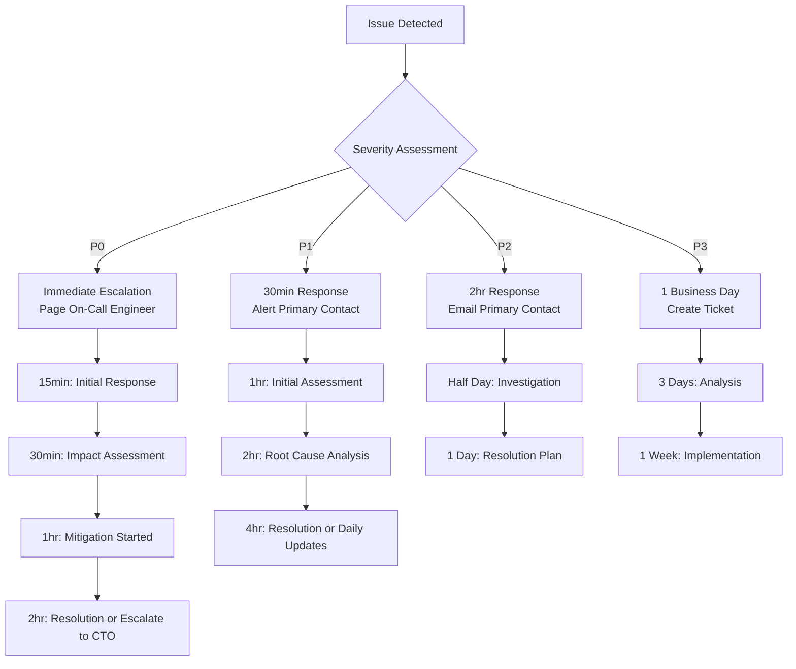

# Monstera Data Issue Escalation Guide

## Table of Contents
1. [Introduction](#introduction)
2. [Issue Classification Framework](#issue-classification-framework)
3. [Escalation Matrix](#escalation-matrix)
4. [Issue Detection Methods](#issue-detection-methods)
5. [Response Procedures by Issue Type](#response-procedures-by-issue-type)
6. [Communication Templates](#communication-templates)
7. [Post-Incident Procedures](#post-incident-procedures)
8. [Preventive Measures](#preventive-measures)
9. [Training and Preparation](#training-and-preparation)

## Introduction

The Monstera framework relies on accurate, timely, and consistent data to enable data-driven decision making across the organization. When metrics deviate from expected patterns or systems experience issues, rapid and appropriate escalation is critical to maintaining trust in the data ecosystem.

### Scope and Objectives

This escalation guide addresses:
- **Data Quality Issues**: Metrics showing unexpected values or trends
- **System Performance Issues**: Slow queries, dashboard timeouts, pipeline failures
- **Schema Compliance Problems**: Events not following Monstera standards
- **Access and Permission Issues**: Users unable to access needed dashboards or data
- **Business Logic Discrepancies**: Metric calculations not matching business expectations

### Key Principles

1. **Speed Over Perfection**: Get the right people involved quickly, refine understanding iteratively
2. **Clear Communication**: Stakeholders need to understand impact and timeline
3. **Documentation**: Every incident teaches us how to improve the system
4. **Proportional Response**: Match escalation level to business impact
5. **Continuous Improvement**: Use incident patterns to strengthen preventive measures

---

## Issue Classification Framework

### Severity Levels

#### P0 - Critical (System Down)
**Criteria:**
- Complete loss of data pipeline or dashboard access
- Data corruption affecting multiple critical metrics
- Security breach or data privacy violation
- Executive dashboard showing incorrect data during board meetings

**Examples:**
- All Monstera dashboards return "No Data Available"
- Event ingestion pipeline has been down for >4 hours
- Daily Active Users metric shows 0 for multiple days
- Data breach exposing user PII in metrics

**Business Impact:** Immediate threat to decision-making capability
**Response Time:** 15 minutes
**Duration:** Resolve within 2 hours

#### P1 - High (Major Impact)
**Criteria:**
- Key metrics showing anomalous patterns (>50% deviation from expected)
- Multiple dashboard visualization errors
- Schema compliance rate drops below 90%
- Data freshness exceeds 4-hour SLA

**Examples:**
- Monthly Active Users dropped 60% overnight with no known business cause
- Video upload metrics showing impossible values (negative numbers, dates in future)
- Overall View dashboard loading but showing inconsistent data across charts
- New user signup events missing critical metadata fields

**Business Impact:** Significant impact on operational decisions
**Response Time:** 30 minutes
**Duration:** Resolve within 4 hours

#### P2 - Medium (Operational Impact)
**Criteria:**
- Single metric showing unexpected trends (20-50% deviation)
- Dashboard performance issues (>30 second load times)
- Minor schema validation failures
- Data freshness between 2-4 hours

**Examples:**
- Video creation metrics trending 25% higher than expected for 3 consecutive days
- Segment View dashboards taking 45 seconds to load
- 5% of events missing optional metadata fields
- Comment creation events delayed by 3 hours

**Business Impact:** May affect specific team decisions
**Response Time:** 2 hours
**Duration:** Resolve within 1 business day

#### P3 - Low (Enhancement/Documentation)
**Criteria:**
- Minor metric discrepancies (<20% deviation)
- User experience issues not affecting data accuracy
- Documentation gaps or unclear metric definitions
- Enhancement requests for existing functionality

**Examples:**
- Slight variations in user engagement calculations between teams
- Dashboard chart tooltips showing unclear information
- Missing data catalog entry for new metric
- Request to add new segmentation option

**Business Impact:** Minimal immediate impact
**Response Time:** 1 business day
**Duration:** Resolve within 1 week

### Issue Categories

#### Data Quality Issues
- **Accuracy**: Metrics don't match expected business reality
- **Completeness**: Missing data points or events
- **Consistency**: Same metric calculated differently across dashboards
- **Timeliness**: Data not refreshing according to SLA

#### System Performance Issues
- **Dashboard Loading**: Slow or failing visualization rendering
- **Query Performance**: Database queries exceeding timeout limits
- **Pipeline Failures**: ETL processes not completing successfully
- **Resource Constraints**: System running out of memory/storage

#### Schema Compliance Issues
- **Missing Required Fields**: Events lacking entity_id, timestamp, etc.
- **Invalid Data Types**: String values in numeric fields, malformed dates
- **Naming Convention Violations**: Events not following taxonomy
- **Metadata Structure**: Incorrect or missing metadata fields

#### Business Logic Issues
- **Calculation Discrepancies**: Metric formulas not matching documentation
- **Segmentation Errors**: Incorrect entity classification or grouping
- **Filtering Problems**: Wrong inclusion/exclusion criteria applied
- **Aggregation Issues**: Incorrect time period or grouping logic

---

## Escalation Matrix

### Contact Hierarchy by Issue Type

| **Issue Type** | **P0/P1 Contact** | **P2/P3 Contact** | **Backup Contact** |
|----------------|-------------------|-------------------|-------------------|
| **Data Quality** | Senior Data Analyst | Data Analyst (Metric Owner) | Analytics Engineering Lead |
| **System Performance** | Data Platform Engineer | Analytics Engineer | Data Engineering Manager |
| **Schema Compliance** | Analytics Engineering Lead | Data Quality Engineer | Senior Data Analyst |
| **Business Logic** | Business Owner (PM/Ops) | Technical Owner (Analyst) | Data Team Lead |
| **Dashboard Issues** | Dashboard Owner | BI Developer | Data Visualization Specialist |
| **Access/Permissions** | Data Platform Engineer | IT Support | Data Governance Lead |

### Escalation Timeline



### Stakeholder Notification Matrix

| **Severity** | **Immediate Notify** | **Within 2 Hours** | **Daily Updates** |
|--------------|---------------------|-------------------|------------------|
| **P0** | Data Team Lead, CTO, Affected Business Owners | All Department Heads, Executive Team | All stakeholders until resolved |
| **P1** | Technical Owner, Business Owner, Data Team Lead | Department heads using affected metrics | Affected business teams |
| **P2** | Technical Owner, Business Owner | Data team members | Technical and business owners |
| **P3** | Technical Owner | N/A | Weekly status in team meetings |

---

## Issue Detection Methods

### Automated Monitoring and Alerting

#### Data Quality Monitors
```sql
-- Example: Monstera Schema Compliance Monitor
WITH schema_check AS (
  {{ validate_monstera_event_schema('bronze.events') }}
)
SELECT *
FROM schema_check
WHERE schema_compliance_rate < 95  -- Trigger P1 alert
   OR schema_compliance_rate < 85  -- Trigger P0 alert
```

**Alert Triggers:**
- Schema compliance rate drops below 95% (P1) or 85% (P0)
- Daily event volume deviates >20% from 7-day average (P2) or >50% (P1)
- Data freshness exceeds 2 hours (P2) or 4 hours (P1)
- Any metric shows impossible values (negative counts, future dates)

#### System Performance Monitors
- Dashboard load times >10 seconds (P2) or >30 seconds (P1)
- Query execution times >60 seconds (P2) or timeouts (P1)
- Pipeline failures or errors (P1)
- Storage usage >80% (P2) or >95% (P0)

### Manual Inspection Triggers

#### Business User Reports
**When users report:**
- "The numbers don't look right"
- "Dashboard is loading slowly or not at all"
- "I can't find the metric I need"
- "The trend doesn't match what I expected"

**Immediate Actions:**
1. Document the specific issue and affected metrics
2. Verify if other users experience the same problem
3. Check if the issue affects related metrics or dashboards
4. Determine business impact and urgency

#### Regular Health Checks
**Daily Reviews:**
- Review overnight batch job logs for failures
- Check data freshness indicators on key dashboards
- Monitor alert queue for unresolved issues
- Validate that key metrics are within expected ranges

**Weekly Reviews:**
- Comprehensive data quality scorecard review
- User feedback and support ticket analysis
- Performance metrics trending analysis
- Schema compliance and drift monitoring

---

## Response Procedures by Issue Type

### Data Quality Issues

#### Immediate Response (First 30 minutes)
1. **Confirm the Issue**
   - Verify the anomaly exists across multiple data sources
   - Check if the issue affects multiple related metrics
   - Determine the time range of the anomaly

2. **Impact Assessment**
   - List all affected metrics and dashboards
   - Identify which business teams are impacted
   - Determine if any critical decisions are pending on this data

3. **Initial Containment**
   - Add data quality warnings to affected dashboards
   - Notify users of the potential issue via dashboard annotations
   - Document the anomaly with screenshots and examples

#### Investigation Phase (Next 2-4 hours)
1. **Root Cause Analysis**
   ```
   Data Quality Investigation Checklist:
   □ Check source system logs for errors or changes
   □ Verify ETL pipeline ran successfully for affected time period
   □ Compare current calculations with historical patterns
   □ Review recent code changes or deployments
   □ Check for data source schema changes
   □ Validate sample of raw data against processed metrics
   ```

2. **Business Context Validation**
   - Contact business owners to confirm no legitimate business changes
   - Check for marketing campaigns, product launches, or external events
   - Validate against alternative data sources if available

#### Resolution Phase
1. **Data Correction**
   - If data error found: Reprocess affected time periods
   - If calculation error found: Fix logic and backfill metrics
   - If source system issue: Coordinate with engineering teams

2. **Validation**
   - Verify corrected metrics match business expectations
   - Run end-to-end data quality tests
   - Get business owner approval on corrected data

### System Performance Issues

#### Immediate Response
1. **System Health Check**
   ```
   Performance Investigation Checklist:
   □ Check database CPU, memory, and disk usage
   □ Review query execution plans for expensive operations
   □ Verify data pipeline status and resource utilization
   □ Check for locked tables or long-running transactions
   □ Monitor network connectivity and latency
   ```

2. **User Impact Mitigation**
   - Display system status messages on affected dashboards
   - Provide alternative access methods if available
   - Set realistic expectations for resolution time

#### Optimization Phase
1. **Query Optimization**
   - Identify and optimize slow-running queries
   - Add appropriate database indexes
   - Implement query result caching where beneficial

2. **Resource Scaling**
   - Increase database or application server resources
   - Optimize data pipeline batch sizes and schedules
   - Implement query queuing to manage concurrent load

### Schema Compliance Issues

#### Immediate Response
1. **Identify Non-Compliant Events**
   ```sql
   -- Find events missing required fields
   SELECT event_type,
          COUNT(*) as event_count,
          COUNT(entity_id) as events_with_entity_id,
          COUNT(timestamp) as events_with_timestamp
   FROM bronze.events
   WHERE event_date = CURRENT_DATE
   GROUP BY event_type
   HAVING COUNT(*) != COUNT(entity_id)
       OR COUNT(*) != COUNT(timestamp)
   ```

2. **Source Identification**
   - Determine which applications or services are sending non-compliant events
   - Check if recent deployments introduced schema changes
   - Identify the scope and duration of the compliance issue

#### Correction Phase
1. **Application Fixes**
   - Work with engineering teams to fix event generation code
   - Implement schema validation at the application level
   - Test fixes in staging environment before production deployment

2. **Data Cleansing**
   - Quarantine non-compliant events to prevent metric corruption
   - Implement data cleaning rules for salvageable events
   - Document events that cannot be recovered

---

## Communication Templates

### Initial Alert Template (P0/P1)

**Subject:** [P0/P1] Monstera Data Issue - [Brief Description]

**Body:**
```
ISSUE SUMMARY:
• Affected Metrics: [List key metrics]
• Time Range: [When issue started - current]
• Business Impact: [Teams/decisions affected]
• Estimated Users Affected: [Number]

IMMEDIATE ACTIONS TAKEN:
• [Action 1]
• [Action 2]

NEXT STEPS:
• [Investigation plan]
• [Estimated timeline for updates]

CONTACT INFORMATION:
• Incident Commander: [Name, Phone, Email]
• Technical Lead: [Name, Phone, Email]

This incident is being actively monitored. Updates will be provided every [X hours/30 minutes].
```

### Status Update Template

**Subject:** [P0/P1] UPDATE - [Brief Description] - [Status]

**Body:**
```
CURRENT STATUS: [Investigating/Mitigating/Resolved]

PROGRESS UPDATE:
• [Key findings or progress made]
• [Actions completed since last update]

CURRENT IMPACT:
• [Updated scope of affected systems/users]
• [Any changes to business impact]

NEXT STEPS:
• [Planned actions with timelines]
• [Next update scheduled for]

RESOLUTION ETA: [Best current estimate]
```

### Resolution Notification Template

**Subject:** [RESOLVED] [P0/P1] - [Brief Description]

**Body:**
```
INCIDENT RESOLVED

FINAL IMPACT:
• Duration: [Start time - End time]
• Root Cause: [Brief explanation]
• Affected Metrics: [Final list]

RESOLUTION SUMMARY:
• [Primary fix implemented]
• [Validation steps completed]
• [Preventive measures added]

POST-INCIDENT ACTIONS:
• Post-mortem scheduled for: [Date/Time]
• Documentation updates: [Timeline]
• Process improvements: [Summary]

Thank you for your patience during this incident.
```

### User Communication Template (Dashboard Annotation)

```
⚠️ DATA QUALITY NOTICE
• Issue: [Brief description]
• Affected Time Period: [Range]
• Status: [Investigating/Fixing/Resolved]
• ETA: [Expected resolution]
• Contact: [Email for questions]

Please use caution when making decisions based on this data.
Alternative data sources: [If available]
```

---

## Post-Incident Procedures

### Incident Documentation

Within 24 hours of resolution, document:

1. **Incident Timeline**
   - Detection time and method
   - Escalation path and response times
   - Key investigation milestones
   - Resolution time and method

2. **Root Cause Analysis**
   - Primary cause of the issue
   - Contributing factors
   - Why existing monitoring didn't catch it sooner
   - What could have prevented the issue

3. **Impact Assessment**
   - Business teams affected
   - Duration of impact
   - Decisions delayed or affected
   - User experience impact

### Post-Mortem Process

**Within 1 Week:**
1. **Stakeholder Meeting**
   - Include all affected business owners
   - Review timeline and impact
   - Discuss lessons learned
   - Prioritize improvement actions

2. **Action Item Generation**
   ```
   Post-Mortem Action Items Template:

   PREVENT RECURRENCE:
   • [Technical improvements needed]
   • [Process changes required]
   • [Monitoring enhancements]

   IMPROVE DETECTION:
   • [New alerts to implement]
   • [Monitoring gaps to address]
   • [Validation checks to add]

   IMPROVE RESPONSE:
   • [Escalation process improvements]
   • [Communication enhancements]
   • [Training needs identified]

   Each action item includes:
   • Owner and deadline
   • Success criteria
   • Priority level
   ```

### Knowledge Base Updates

1. **Documentation Updates**
   - Add new troubleshooting steps to runbooks
   - Update escalation procedures if needed
   - Enhance monitoring and alerting documentation

2. **Training Material Updates**
   - Create case studies for similar future issues
   - Update user training on recognizing data quality issues
   - Enhance technical team incident response training

---

## Preventive Measures

### Proactive Monitoring Enhancement

#### Expand Automated Alerting
Based on incident patterns, implement:

```sql
-- Example: Business Logic Validation
-- Alert if key metrics deviate significantly from predictions
WITH metric_validation AS (
  SELECT
    metric_date,
    daily_active_users,
    -- Simple moving average prediction
    AVG(daily_active_users) OVER (
      ORDER BY metric_date
      ROWS BETWEEN 7 PRECEDING AND 1 PRECEDING
    ) as predicted_dau,

    -- Calculate deviation percentage
    ABS(daily_active_users - predicted_dau) / predicted_dau * 100 as deviation_pct

  FROM gold.overall_metrics
  WHERE metric_date >= CURRENT_DATE - INTERVAL '30 days'
)

SELECT *
FROM metric_validation
WHERE deviation_pct > 30  -- Alert threshold
  AND metric_date = CURRENT_DATE
```

#### Implement Data Lineage Monitoring
- Track data dependencies across the pipeline
- Monitor for upstream changes that could affect metrics
- Alert when source system schemas change

### Improve Data Quality Standards

#### Enhanced Validation Rules
```sql
-- Comprehensive event validation macro

  SELECT
    'data_quality_check' as check_type,
    '{{ table_name }}' as table_name,

    -- Temporal validation
    COUNT(CASE WHEN timestamp > CURRENT_TIMESTAMP THEN 1 END) as future_events,
    COUNT(CASE WHEN timestamp < CURRENT_TIMESTAMP - INTERVAL '7 days' THEN 1 END) as very_old_events,

    -- Value range validation
    COUNT(CASE WHEN (metadata->>'session_duration_minutes')::int < 0 THEN 1 END) as negative_durations,
    COUNT(CASE WHEN (metadata->>'file_size_mb')::float > 10000 THEN 1 END) as unrealistic_file_sizes,

    -- Business logic validation
    COUNT(CASE WHEN event_type = 'video_upload' AND metadata->>'video_id' IS NULL THEN 1 END) as upload_missing_video_id,

    -- Referential integrity
    COUNT(CASE WHEN entity_type = 'user' AND entity_id NOT IN (SELECT user_id FROM bronze.users) THEN 1 END) as orphaned_user_events

  FROM {{ table_name }}
  WHERE event_date = CURRENT_DATE

```

#### Implement Tiered Quality Thresholds
- **Tier 1 (Executive dashboards)**: 99.5%+ accuracy, <30min freshness
- **Tier 2 (Operational metrics)**: 95%+ accuracy, <2hr freshness
- **Tier 3 (Exploratory analysis)**: 90%+ accuracy, <24hr freshness

### Strengthen Change Management

#### Pre-Deployment Validation
1. **Schema Change Review Process**
   - All event schema changes require data team approval
   - Impact assessment on downstream metrics
   - Rollback plan for failed deployments

2. **Metric Calculation Changes**
   - A/B testing of new calculation logic
   - Historical backfill validation
   - Business stakeholder approval required

#### Deployment Safeguards
- Canary deployments for data pipeline changes
- Automated rollback triggers for data quality degradation
- Real-time monitoring during deployment windows

---

## Training and Preparation

### User Education Program

#### For Business Users
**Monthly Training Sessions:**
1. **Recognizing Data Quality Issues**
   - What constitutes normal vs. abnormal metric patterns
   - When to escalate vs. when to investigate independently
   - How to interpret data quality indicators on dashboards

2. **Effective Issue Reporting**
   - Information needed for quick triage
   - Using proper communication channels
   - Setting realistic expectations for resolution

#### For Technical Teams
**Quarterly Training:**
1. **Incident Response Simulation**
   - Practice with realistic data quality scenarios
   - Role-playing escalation procedures
   - Communication exercise under pressure

2. **Advanced Troubleshooting Techniques**
   - SQL techniques for data quality investigation
   - Using system monitoring tools effectively
   - Root cause analysis methodologies

*This document is part of the Monstera framework ecosystem and should be used in conjunction with the Monstera Company Metric Design document and Gap Analysis Guide.*
